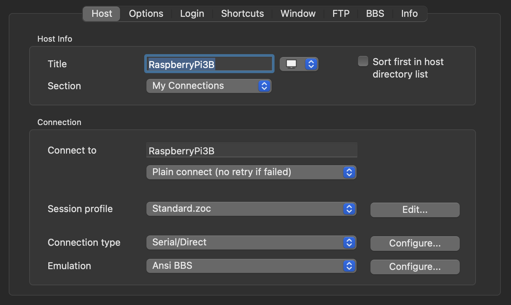
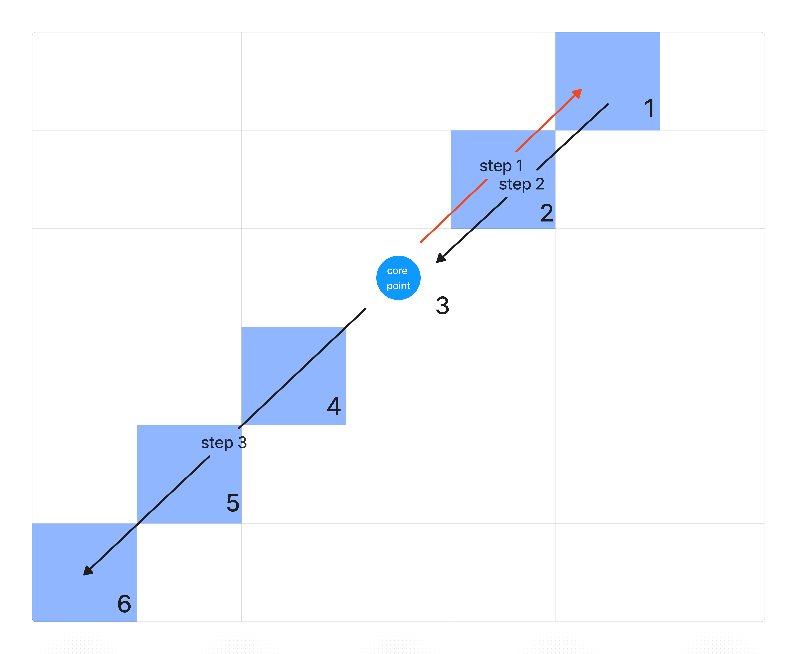
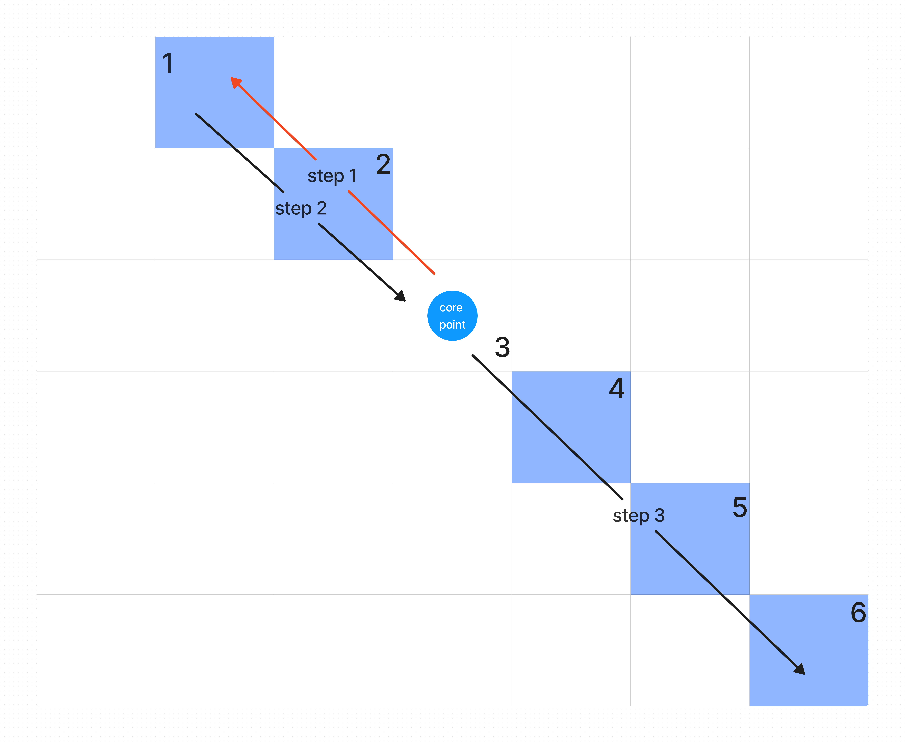
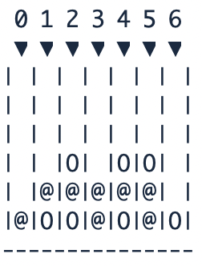

# Connect 4 on bare-metal Raspberry Pi 3B

Mauro Russo, April 2023

# Introduction

This essay describes the developed system, which is the implementation of the famous game Connect 4.
It is a 1-vs-1 game and the aim is to connect at least 4 of your tokens in a line, which can be a row, a column or a diagonal.

The __hardware__ section describes the components used in this project.  
The __environment__ section describes the software tools used to load and run the code.  
The __software__ section describes the developed modules.  
Finally, the __conclusion__ section sums up the contents of this report and present some possible future improvements to this project.

# Hardware

## Raspberry Pi model 3B+

The target for this project is a general-purpose Single-Board Computer: the Raspberry Pi 3B+

It is based on the Broadcom BCM2837 chip and boasts high-end specs:

* Broadcom BCM2837B0, Cortex-A53 (ARMv8) 64-bit SoC @ 1.4GHz
* 1GB LPDDR2 SDRAM
* 2.4GHz and 5GHz IEEE 802.11.b/g/n/ac wireless LAN, Bluetooth 4.2, BLE
* Gigabit Ethernet over USB 2.0 (maximum throughput 300 Mbps)
* Extended 40-pin GPIO header
* Full-size HDMI
* 4 USB 2.0 ports
* Micro SD port for loading your operating system and storing data
* 5V/2.5A DC power input
* Power-over-Ethernet (PoE) support (requires separate PoE HAT)

## FTDI FT232RL

The FT232RL is a USB to serial UART interface.
Since modern computers do not expose serial ports that can be connected to the GPIOs, this peripheral let to send data to and from the Pi. 
The FTDI module is connected to a computer through its USB port, and to the Raspberry Pi 4 UART1 by the following configuration:

* FTDI-RX to RPi-GPIO14 (TX)
* FTDI-TX to RPi-GPIO15 (RX)
* FTDI-Ground to RPi-GND

# Environment

## pijFORTHos

FORTH interpreters can be implemented easily for resource-constrained machines using no OS, so they are well-suited for bare-metal interactive development.

The pijFORTHos environment is based on an assembly FORTH interpreter called JonesForth, originally written for i686 assembly by _Richard WM Jones_.

Due to its simplicity, JonesForth has been adapted to many different architectures, one of those in particular, Jonesforth-ARM, brought to the Bare-Metal FORTH interpreter for the Raspberry Pi pijFORTHos.  
This interpreter, not only allows executing FORTH code but also allows connection to another machine through the Raspberry Pi serial console.

## ZOC
ZOC is a popular computer-based terminal emulator and Telnet software client for the Microsoft Windows and Apple Macintosh macOS operating systems that supports telnet, modem, SSH 1 and 2, ISDN, serial, TAPI, Rlogin and other means of communication. Its terminal emulator supports Xterm emulation with full colors, meta-keys and local printing, VT102, VT220 and several types of ANSI as well as Wyse, TVI, TN3270, and Sun's CDE. It supports full keyboard remapping, scripting in REXX and other languages, and support for named pipes.
In the scope of this project, it is used as a serial communications program to allow access to the serial console of the Raspberry.

To create the connection, first connect the Raspberry Pi through the UART and the USB cable. Then, open ZOC8, create a new connection and set these parameters.

Then, open the connection just created and switch the Raspberry Pi on. Load the main.f file using the funcionality "Send Text File" and start to play!

# Software
Since it is not possible with the selected environment to have the Raspberry automatically load the source code from the storage at startup, the code is to be sent via a serial connection.
The file transfer happens character by character at a quite limited speed, with significant delay after every character and newline.

## ANSI compliance
JonesForth is not ANSI compliant, hence some standard words do not behave as one would expect.

The code provided by Professor D. Peri in the course materials contains some definitions to ensure compliance for some words of common use. This code has been added at the top of the file main.f.
Hence this code is the first to be loaded to guarantee that each subsequent instruction is executed as intended.

## Check victory
Every move done by a user is followed by the execution of the function CHECK_VICTORY. This function checks if the user that has just inserted his token has managed to create a line of at least 4 tokens. Starting from the element last inserted, the function checks if there is a row, a column or a diagonal "close to it". CHECK_VICTORY consists of 4 subfunctions: COLUMN_CONTAINS_4, ROW_CONTAINS_4, CHECK_DIAGONAL_45, CHECK_DIAGONAL_135. Each of these produces a "boolean" and put it onto the stack, then they are "reduced" by logical OR and if one of these is true, then the user has won the match.
### Check column
The function COLUMN_CONTAINS_4 iterates through the entire column to find a 4-length line. Its implementation is quite simple.

### Check row
The function ROW_CONTAINS_4 iterates through the entire row to find a 4-length line. Its implementation is quite simple.

### Check diagonals
The function CHECK_DIAGONAL_45 checks if there is a 4-length line in the 45 degrees diagonal which the token just inserted belongs to.
The function CHECK_DIAGONAL_135 does the specular for the 135 degrees diagonal which the same previous token belongs to.

Let's talk about CHECK_DIAGONAL_45.
The building of the diagonal is decomposed in 3 parts: the upper part of the diagonal, the element just inserted (which we will call "core point" for simplicity) and the lower part.
To build the upper part we use 2 temporary indexes, one for the column and one for the row. The temporary column index starts from the current column index (the column index of the core point) and it is incremented by 1; The temporary row index starts from the current row index (the row index of the core point) and it is decremented by 1. At every step, we evaluate the these temporary indexes to understand if they represent a valid element inside of the matrix, and if yes we increment the variable UPPERSIZE_45 to keep track of the number of elements that form the upper diagonal, otherwise it means indexes went out of matrix edges and in this case we can stop the iteration. If the size of the upper diagonal is greater than 0, then we can start to add diagonal elements to the stack in order to be evaluated, so we take the temporary indexes and we iterate on them inversely (decrement the temporary column index and increment the temporary row index). At each iteration we put the matrix element onto the stack. The iteration stops when we reach the core point.
Then we add the core point to the stack.
In the end, we build the lower part of the diagonal. The process is similar to the upper part building, but in this case we don't need to iterate twice, but just one, because the "direction" we iterate through indexes let us push the elements values to the stack in order. So, in this case, we decrement temporary column index and we increment temporary row index and while doing this, we push the corresponding matrix element onto the stack.
While pushing elements onto the stack, we kept track of the size in the variable SIZE45.
Now the have the length of the diagonal and all its values onto the stack, we can iterate to discover if there is a 4-length line among them.

In the image, arrows indicate the "process direction", while sqaure numbers indicate the order they are put onto the stack.

The process for CHECK_DIAGONAL_135 is the same but we iterate through temporary indexes in the opposite way, in order to follow the 135 degrees direction.

## Input

The users put their token using the function ADD. Thej just need to type the number of the column they want to insert the token to plus the word 'ADD'. Example: 4 ADD -> the token will be inserted in the fourth column.

## Output

After every move, the terminal print the matrix containing all the tokens. The symbol 'O' is used for player n.1 and the symbol '@' is used for player n.2. Empty spaces stands for empty values.

# Conclusion

Implementing the algorithm to check diagonals has been not that easy because of numerous limits and constraints, but in the end all the functionalities were implemented as planned with satisfying reliability.
This project, due to the critical nature of correct input interpretation, led to facing interesting hardware issues and delving into undocumented features of the target hardware.

## Code availability

This project is available on GitHub at [https://github.com/maurorusso22/Forth_project](https://github.com/maurorusso22/Forth_project).

## Possible improvements

I chose to check out the lines in their entirety, because otherwise I should have check every 4-length line near the last inserted element (aka core point). This means, for instance, that if I wanted to check the row, I should have considered 3 elements at the left of the element plus the core point, or 2 elements at its left plus the core point plus the first one to its right, or the core point plus the 3 elements at its right. This can be done implementing a complex and computationally expensive iterating algorithm, and not to mention you should execute it for columns and diagonals too. It is quite obvious that this solution would slow down the execution of the game.
Therefore, an improvement could be to find better and faster ways to check the victory.